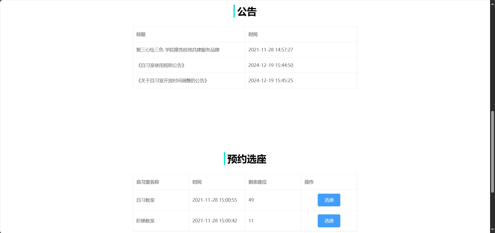
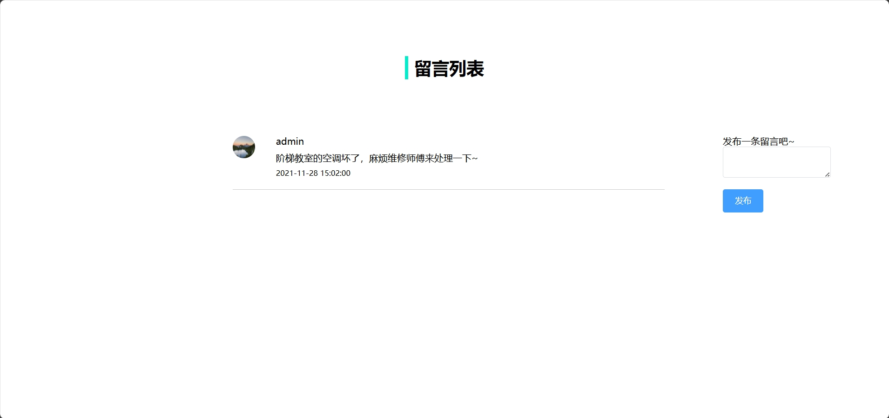
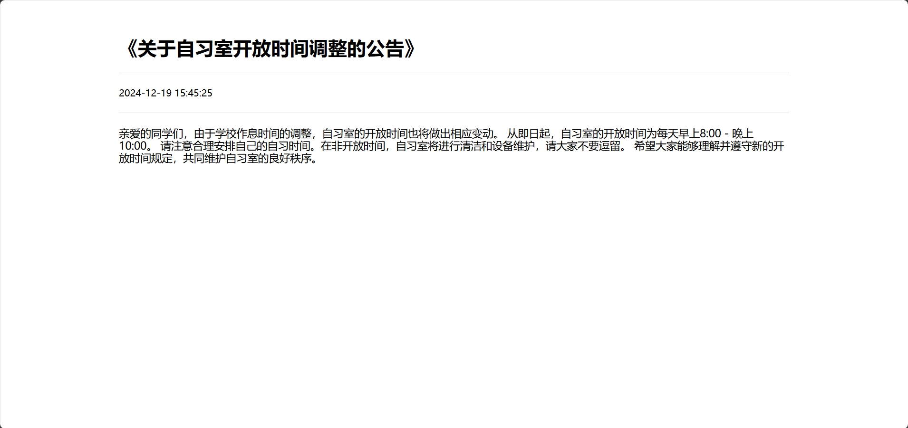
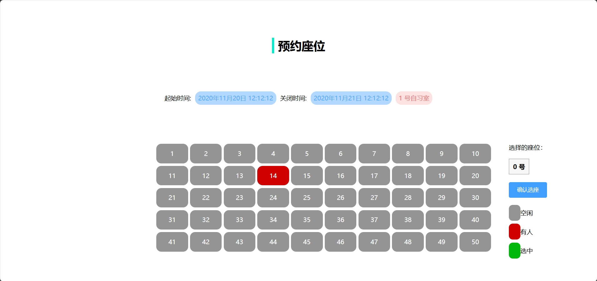
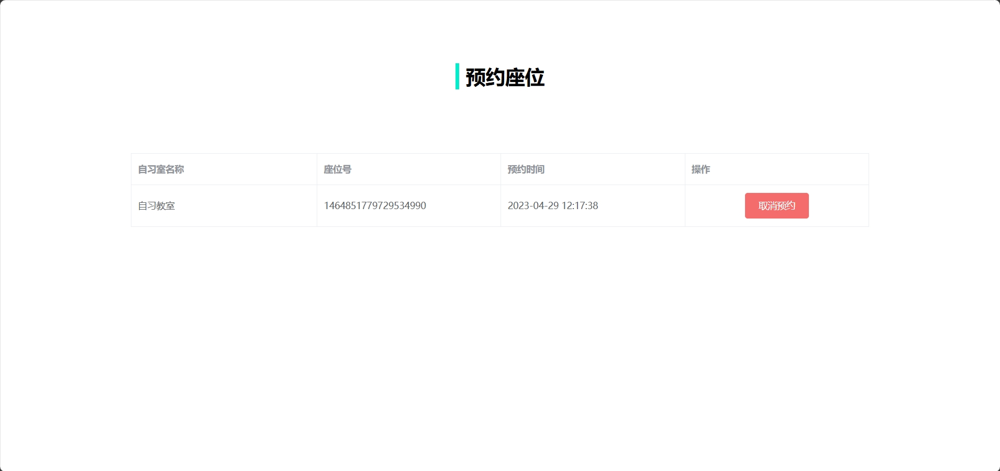
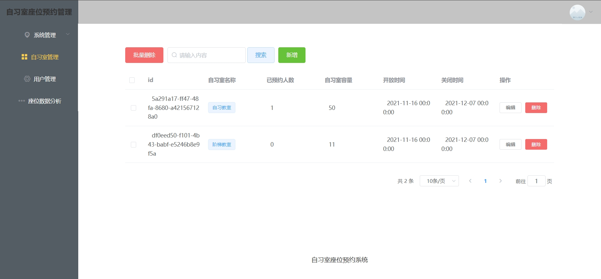
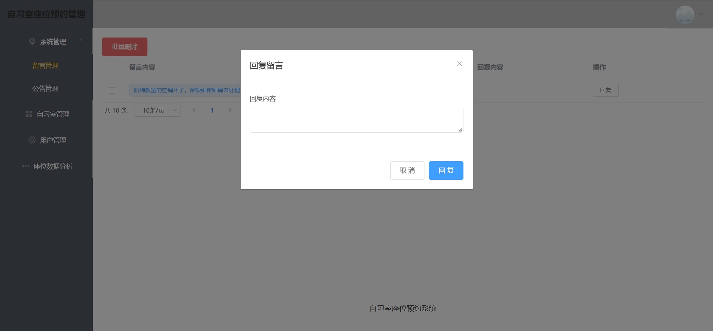
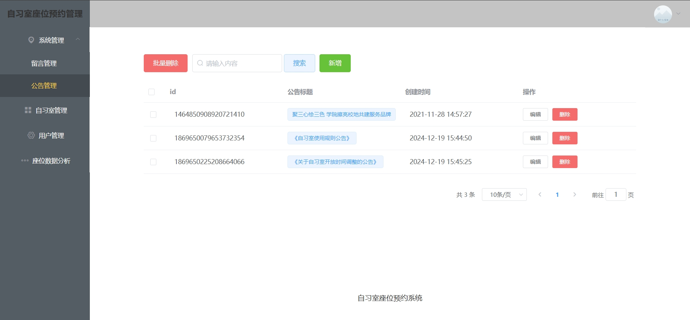
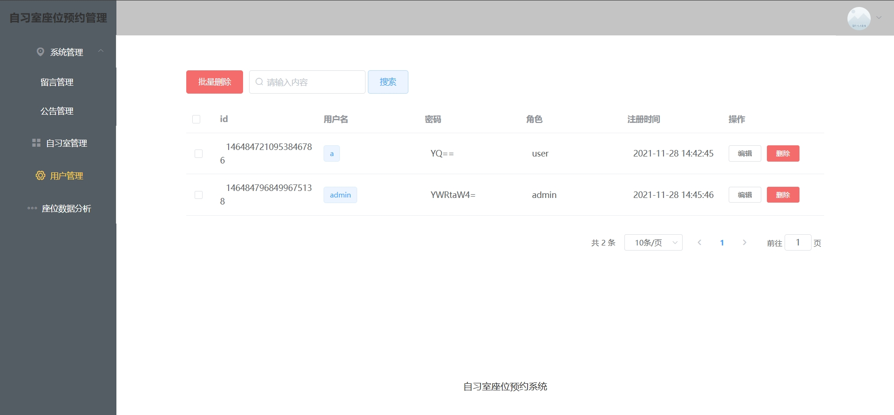
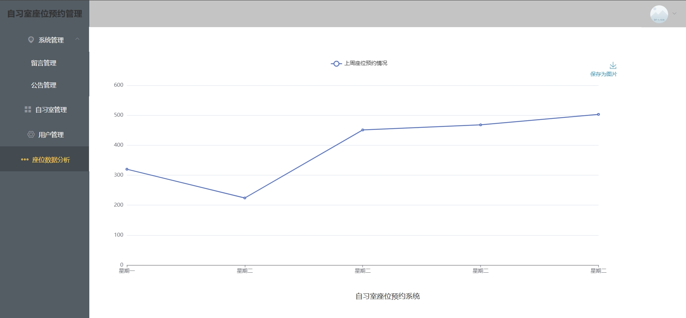

# 简易自习室座位预约系统(文末免费领取☟)
> 
#### 介绍
自习室座位预约系统（SpringBoot+Vue）
有BUG可留言加微

#### 软件架构
Java + SpringBoot + Vue + Mybatis + Mysql

#### 项目功能说明

1. 管理员功能
> + 系统管理：留言管理、公告管理
> + 自习室管理
> + 用户管理
> + 座位数据分析
2. 用户功能
> + 登录注册
> + 首页：公告展示、预约选座
> + 留言面板
> + 预约记录

### 部分功能演示

### 环境需求(可免费提供)
- idea/eclipse、jdk-1.8、maven-3.8.6、mysql、redis、nodejs等

## 有项目修改、安装调试需求 请联系以下

## 获取资源扫☝☝☝
